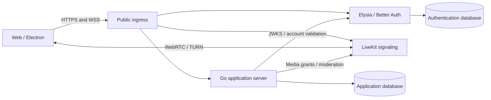

# Architecture

## Service boundaries

| Component | Responsibility | Implementation |
| --- | --- | --- |
| Web client | Community UI, voice controls, moderation, administration | React, TypeScript, Tailwind, shadcn/ui with Base UI |
| Desktop shell | Saved servers, platform integration, packaged application | Electron with the shared React client |
| Landing | Public project information and downloads in EN/PL | Astro |
| Application server | Guests, membership, permissions, channels, messages, presence, voice admission | Go |
| Authentication service | Owner/moderator credentials and sessions, JWT signing and JWKS | Bun, TypeScript, Elysia 2 Beta, Better Auth |
| Media server | WebRTC media transport and TURN connectivity | Self-hosted LiveKit |
| Database | Durable application and authentication data | PostgreSQL; separate databases and database roles |
| Public ingress | Trusted HTTPS and routing to local services | Reverse proxy; implementation default: Caddy |

All runtime services for one community belong to one Docker Compose project. The landing is deployed independently. Start with one host and one application-server instance. Multi-host clustering, Kubernetes, and federation are deferred.

Build-time tooling is separate from this runtime topology: pnpm owns JS/TS dependencies, Turborepo schedules repository tasks, and standard Vite builds the React client. Bun continues to execute AUTH; Electron uses its own runtime. See [Approved toolchain](toolchain.md) for the selected configuration and decision rationale.

The diagram separates media transport from HTTP ingress: configuring HTTPS alone does not make UDP media or TURN reachable. Stage 1 must verify domains, public address advertisement, certificates, exposed ports, and restrictive-network fallback together. Additional media/TURN hostnames may be required even though users enter one community address.

## Identity and authorization

Go owns the community's participant identifiers and permissions. Better Auth owns registered-account authentication. A binding from a trusted authentication issuer and subject to a participant identifier connects them; Go never queries Better Auth's database directly.

Guests use a server-issued opaque credential and a persistent participant ID. Technical defaults:

- Browser guest credentials use same-origin secure HttpOnly cookies. Browser storage holds preferences and non-secret UI state, not privileged bearer tokens.
- Electron stores per-server credentials using an OS-protected mechanism exposed through narrowly scoped IPC. Secrets are not stored in renderer localStorage.
- Keep renderer sandboxing and context isolation enabled. Bundle the desktop renderer locally; do not give arbitrary server pages access to privileged Electron APIs.
- Verify the desktop cross-origin/session integration in Stage 1. Native origins, CORS, cookie behavior, and authenticated requests require an explicit tested contract rather than an assumption that the browser flow transfers unchanged.

Registered users authenticate with Better Auth. Its JWT plugin issues a short-lived token for Go to verify using JWKS. Validate the configured issuer, intended audience, signature algorithm, expiry, and subject. Fetch keys only from the installation's configured trusted issuer. A token-provided URL must never choose the trust source.

Cache JWKS with bounded refresh and planned key overlap during rotation. Unknown keys or invalid tokens fail closed. AUTH downtime must not stop established guest chat or voice. Valid registered-user tokens may continue within their expiry and cached-key policy; new login and refresh depend on AUTH availability. Test and document these boundaries.

JWT verification establishes identity; Go checks current roles, bans, and channel access at each privileged operation. Token expiry is not a substitute for immediate moderation or account revocation. Stage 1 defines and tests account/session revocation propagation from AUTH to Go, including active WebSocket connections. Keep this integration behind a small interface.

Public registration is disabled initially. Host-authorized setup creates the owner; the owner provisions or invites moderator accounts. Future Google sign-in and participant accounts are extensions, not active features. No central account provider is required.

mTLS is deferred. Internal AUTH/Go communication uses the private Compose network; public access is routed through HTTPS. Databases and internal management endpoints are not exposed as public ports.

## Application protocols and persistence

Implementation defaults are a versioned HTTP JSON API with an OpenAPI contract, and WebSocket events for messages, presence, and channel changes. Share generated transport types with TypeScript clients; keep the protocol usable from Swift, Kotlin, and Rust.

Persist messages before acknowledging delivery or broadcasting committed events. Give sends a client-generated request identifier and enforce deduplication across retries. Clients reconcile by authoritative message IDs. After reconnect, recover durable history through the API; ephemeral events may be replaced by a current-state snapshot.

Go owns installations/settings, participants, account bindings, memberships, invitations, bans, categories, channels, messages, and moderation audit records. AUTH owns accounts, credentials, sessions, and signing-key persistence. Each service owns migrations for its own database and uses its own least-privilege database role.

Use foreign keys and indexes suited to stable message pagination and participant references. Treat invite redemption and usage limits transactionally. Keep presence ephemeral; do not require Redis solely for presence on the initial single-node deployment. Evaluate any LiveKit Redis requirement against the pinned deployment version in Stage 0 and record the outcome.

## Media admission and moderation

Go checks membership and permissions before issuing a narrowly scoped, short-lived LiveKit grant. Clients never receive a LiveKit server secret. Media identity is tied to the authoritative participant ID, not a user-selected nickname.

Go coordinates kick, ban, room departure, and forced mute with LiveKit. Forced mute must also prevent unauthorized unmuting/publication. Removing a connected participant is not sufficient if an already-issued media token permits re-entry. Stage 1 must verify replay after removal, permission changes, token expiry, and reconnect against the pinned self-hosted LiveKit version. Resolve gaps before declaring moderation complete.

Chat history is stored in PostgreSQL and transported by the application protocol, not treated as durable LiveKit room data. Audio is not recorded. Limit a client to one active conversation, including switching between saved installations.

## Compatibility investigations

The following are implementation gates, not requests to reopen approved product decisions:

1. Pin Elysia 2 Beta, Bun, Better Auth, and JWT/JWKS integration; run login, expiry, rotation, and revocation tests.
2. Verify guest credential persistence and registered login in both Web and Electron.
3. Demonstrate enforceable media moderation with self-hosted LiveKit.
4. Validate mobile browser devices, reconnect, and foreground audio on real devices.
5. Validate Oxlint's JS plugin integration with `@shadcn/lint` and determine an Oxfmt-compatible formatter strategy for Astro files.

An implementation blocker should produce a narrow decision record containing the failing behavior, evidence, and proposed alternative. Do not silently replace Elysia 2 Beta or other approved technologies.

## Upstream references

References inspected during planning; recheck exact versions during Stage 0:

- [Elysia and Better Auth](https://elysiajs.com/integrations/better-auth)
- [Elysia 2 Beta](https://elysiajs.com/blog/elysia-20)
- [Better Auth JWT/JWKS](https://better-auth.com/docs/plugins/jwt)
- [Better Auth PostgreSQL](https://better-auth.com/docs/adapters/postgresql)
- [LiveKit self-hosting](https://docs.livekit.io/transport/self-hosting/)
- [LiveKit deployment and TURN](https://docs.livekit.io/transport/self-hosting/deployment/)
- [LiveKit distributed deployment](https://docs.livekit.io/transport/self-hosting/distributed/)
